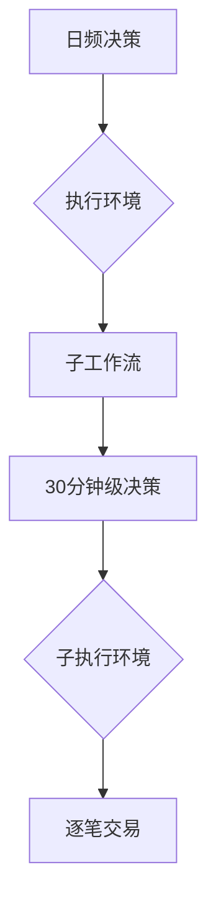

### 书写一个公式

这是一个行内公式 $s=\sqrt{\frac{1}{n-1} \sum_{i=1}^{n} (x_i - \bar{x})^2}$

这是一个行间公式：
$$y_i=\frac{x_i-\bar{x}}{s}$$

再写一个复杂行间公式公式：
$$R_{it}^{e} = \alpha_i + \beta_{i1} R_{ft}^1 + \beta_{i2} R_{ft}^2 + ... + \beta_{iK} R_{ft}^K + \epsilon_{it}, \quad t = 1, 2, ..., T$$

### 添加 Mermaid 图表
    
