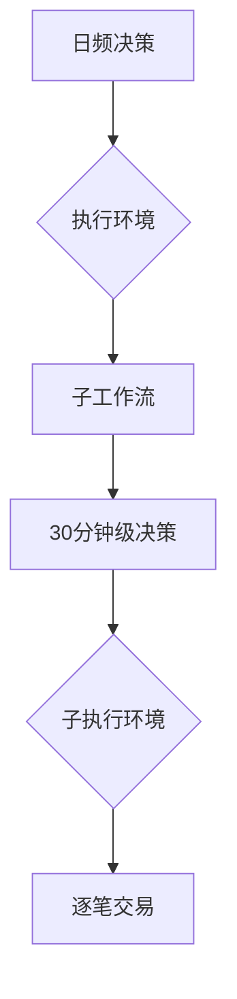

### 书写一个公式

这是一个行内公式 $s=\sqrt{\frac{1}{n-1} \sum_{i=1}^{n} (x_i - \bar{x})^2}$

这是一个行间公式：
$$y_i=\frac{x_i-\bar{x}}{s}$$

再写一个复杂行间公式公式：
$$R_{it}^{e} = \alpha_i + \beta_{i1} R_{ft}^1 + \beta_{i2} R_{ft}^2 + ... + \beta_{iK} R_{ft}^K + \epsilon_{it}, \quad t = 1, 2, ..., T$$

### 添加 Mermaid 图表
    

### 在线生成HTML表格工具
在线生成HTML表格工具：[链接](https://boost-tool.com/zh/tools/html_table_create)

### 添加一个合并行表格

<table>
    <tr>
        <td>列一</td>
        <td>列一</td>
   </tr>
    <tr>
        <td colspan="2">合并行</td>
    </tr>
    <tr>
        <td colspan="2">合并行</td>
    </tr>
</table>

### 添加一个合并列表格

<table>
    <tr>
        <td>列一</td>
        <td>列二</td>
   </tr>
    <tr>
        <td rowspan="2">合并列</td>
        <td >行二列二</td>
    </tr>
    <tr>
        <td >行三列二</td>
    </tr>
</table>

### 添加一个合并行列表格

<table>
    <tr>
        <td>列一</td>
        <td>列二</td>
   </tr>
   <tr>
        <td colspan="2">合并行</td>
   </tr>
   <tr>
        <td>列一</td>
        <td>列二</td>
   </tr>
    <tr>
        <td rowspan="2">合并列</td>
        <td >行二列二</td>
    </tr>
    <tr>
        <td >行三列二</td>
    </tr>
</table>

