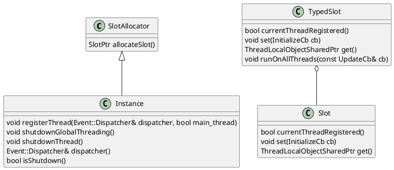

```plantuml
@startuml
SlotAllocator <|-- Instance
TypedSlot o-- Slot

Slot : bool currentThreadRegistered()
Slot : void set(InitializeCb cb)
Slot : ThreadLocalObjectSharedPtr get()

TypedSlot : bool currentThreadRegistered()
TypedSlot : void set(InitializeCb cb)
TypedSlot : ThreadLocalObjectSharedPtr get()
TypedSlot : void runOnAllThreads(const UpdateCb& cb)

SlotAllocator : SlotPtr allocateSlot()

Instance : void registerThread(Event::Dispatcher& dispatcher, bool main_thread)
Instance : void shutdownGlobalThreading()
Instance : void shutdownThread()
Instance : Event::Dispatcher& dispatcher()
Instance : bool isShutdown()
@enduml
```